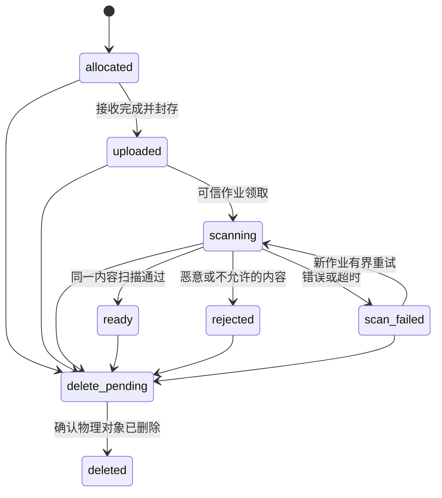

# P4-21 文件元数据生命周期与授权合约设计

## 1. 目标与审阅状态

2026-10-04 更新：规格与实施计划均已确认，P4-21 已实施领域模型和隔离数据库约束；实际回归、评审与交付状态见 [验收记录](../../开发增量-P4-21-验收记录.md)。下述“尚未实施”语句保留为原设计交付时的历史状态，不表示当前实现状态。

让集团员工在获准的单聊和群聊中分享文件，接收者通过服务端授权入口下载；文件访问服从当前任职、会话边界、扫描结论与保留期。管理员身份不授予读取业务文件的权限。历史文本可读不代表附件可下载。

用户于 2026-10-04 确认采用 P4-21～P4-25 的分步交付和服务端重新授权下载方案。本文将该方向落成书面规格，用户随后以“继续”确认该规格。[P4-21 实施计划](../plans/2026-10-04-p4-21-file-foundation.md)已形成，待审阅确认后实施。没有实施文件功能、安装依赖或执行迁移。

产品基线为仓库《enterprise_im_group_v2_2.docx》的第 8、10、13、14 章及 F01：私有对象存储、元数据与授权入库、恶意内容扫描、每次下载复核、默认文件保留 365 天。代码基线为 P4-20 `b24f963c94c76fbc8082cd7cdb564515d7669285`、[草稿 PR #68](https://github.com/leileipei/Enterprise_IM/pull/68)。本设计分支为 `codex/p4-21-file-foundation-design`。

## 2. 已核对的现有基础

| 已有事实 | 位置 | 本次处理 |
| --- | --- | --- |
| 消息为 text_body，已有正文清理状态；没有消息类型或附件关联 | db/migrations/000006_message_write.up.sql、000015_message_body_clear.up.sql | P4-21 不改消息合约；P4-23 单独增加附件消息及兼容迁移 |
| 单聊、群聊已有幂等、会话 seq、审计与 Outbox 事务 | internal/policystore/messages.go、group_message_send.go | 附件绑定必须加入同一事务，不能上传后直接占用消息 seq |
| 文本历史支持历史区间，退群后可保留部分正文读取 | internal/policystore/history_read_tx.go、group_history.go | 文件必须额外检查当前成员资格，不能直接把历史读取助手当成下载授权 |
| 策略引擎和数据库动作枚举没有 file_download | internal/policy/evaluator.go、db/migrations/000003_policy_store.up.sql | P4-24 同时扩展规则约束、发布校验、判定与测试；P4-21 不启用新动作 |
| 租户配置只有消息正文保留天数，当前管理 API 也只覆盖该项 | db/migrations/000013_tenant_retention.up.sql、internal/access/retention.go | 文件期限单独配置，不能假装现有设置已经覆盖文件 |
| 法务保全按会话登记，默认只暂停已有正文／摘要清理 | db/migrations/000014_conversation_legal_hold.up.sql | 文件清理接入时需复用并验收，不把当前 Worker 宣称为文件清理能力 |
| 未发现文件表、对象存储适配器、上传／下载 API 或扫描服务 | db/migrations、internal、go.mod | 新模块独立建立；现有文本搜索继续履行原合约 |

## 3. 方案选择与交付顺序

| 方案 | 适用性与成本 |
| --- | --- |
| **采用：私有 MinIO＋服务端上传／下载＋数据库生命周期** | 文件访问经过可信身份入口；每次请求可重新授权并记审计。服务端需承担流量、超时及并发控制，容量须另验 |
| 浏览器直接使用对象存储预签名链接 | 客户端直传吞吐更好；链接有效期内的使用不天然执行 IM 当前任职和成员检查，上传覆盖与扫描内容绑定也需额外设计 |
| 文件内容保存在 PostgreSQL | 可简化部分事务，但增加消息事实库的存储、备份与恢复负担；本产品已有 MinIO 基线 |

采用第一种方案。客户端只接触文件 ID 和受保护的应用路由，不获得 bucket、对象 key、存储凭据或对象存储直连下载地址。短效下载凭证即使后续引入，也只能指向应用授权入口，不能替代每次授权。

| 增量 | 独立交付内容 |
| --- | --- |
| P4-21 | 文件元数据、生命周期与字段校验、复合租户约束、不可变状态证据及授权合约；真实数据库迁移测试 |
| P4-22 | 对象存储适配器、受保护的创建／上传／状态查询 API、可信扫描 Worker、租户上传限制及并发失败验收 |
| P4-23 | 单聊／群聊附件消息、附件绑定、规范幂等摘要、同步／Outbox 兼容；重试不重复发送 |
| P4-24 | 服务端授权下载、文件专属策略、文件保留配置、法务保全与可恢复清理；F01、撤权和清理竞争验证 |
| P4-25 | Web 上传与扫描状态、发送／下载、可编辑限制设置、附件名称搜索及浏览器联调 |

附件内容解析、OCR、Office 正文索引、独立文件再授权、跨会话复用、大文件分片／续传、在线预览为后续能力。P4-25 的名称搜索只在授权附件中匹配，不读取附件内部内容。

## 4. P4-21 的精确实施范围

新建 `internal/files` 领域包，只包含元数据类型、输入规范和生命周期转移校验。新增下一编号 `000018` 迁移建立 `file_objects` 和 `file_lifecycle_events`，及用于完成这些表约束的索引／触发器。文件 ID 和上传请求 ID 使用规范 UUID，解析后统一小写；服务端随机生成文件 ID，上传请求 ID 由客户端生成，两者是不同字段，后者用于创建预约的幂等。序号和状态 version 使用非负 int64，HTTP 展示时沿用十进制字符串防止精度丢失。

本切片不注册 HTTP 路由，不创建可下载文件、不改现有消息 DTO／发送／补拉／搜索，不启用 Worker，不接入 MinIO 或扫描软件。没有对外状态变更服务；未来 P4-22 服务负责调用状态校验并在事务中更新状态、事件和审计。数据库约束不被宣称能验证恶意内容。

P4-21 测试覆盖输入与转移的真实错误条件，以及隔离 PostgreSQL 上的 Up／Down、同租户关联、不可变来源、封存后的不可变内容指纹、状态版本、事件不可变和索引约束。完成模型不代表文件上传、分享或下载已可用。

## 5. 数据模型与不变量

### 5.1 file_objects

| 字段组 | 约束与含义 |
| --- | --- |
| id、tenant_id、conversation_id | 文件 ID、可信租户和单一目标会话；UNIQUE(tenant_id,id)，复合外键引用 conversations(tenant_id,id) |
| uploader_user_id、uploader_membership_id | 真实上传者及创建时任职；复合外键引用 user_organizations(tenant_id,user_id,id)，跨租户／他人任职关联拒绝 |
| upload_request_id、request_digest | UNIQUE(tenant_id,uploader_user_id,upload_request_id)；摘要为服务端规范创建参数的 SHA-256，固定 32 字节 |
| original_filename、declared_media_type、declared_size_bytes | 客户声明，只用于校验和展示；不是存储路径、真实内容证明或授权证据 |
| object_key、object_version_id | 服务端生成的私有定位；上传完成前可为空，完成后必须明确定位同一对象版本。tenant 与随机 file ID 纳入 key；不按 filename 或内容摘要共用对象 |
| actual_size_bytes、sha256、detected_media_type、uploaded_at | 服务端实测字节数、32 字节内容摘要、实际类型及完成时间；上传封存时一次填齐，此后不得替换。不能用 ETag 当作 SHA-256 |
| state、state_version | 第 6 节的状态；初始 allocated／0，每次允许转移 version 恰好加 1，不能跳过或倒退 |
| upload_expires_at、created_at、updated_at | 预约到期时间严格晚于创建；更新时间不倒退。完成封存发生在预约到期前；扫描可在其后结束，预约期限不充当文件保留期限 |
| scan_job_id、scan_engine、scan_definition_version、scanned_at、scan_sha256 | scanning 时绑定当前作业；ready 必须有完整清洁结论，scan_sha256 与封存 sha256 相同，检测时间不早于 uploaded_at |
| deletion_requested_at、deleted_at | delete_pending／deleted 的一向时间证据；进入 delete_pending 后禁止发送和下载；deleted 不能恢复 |

tenant、会话、上传者、任职、请求 ID、请求摘要及创建参数在创建后不可修改；仅到 deleted 时允许按下文规则清空内容相关字段，其余来源保持不可变。实际大小须等于声明大小，且落在首版模型硬上限内；客户端摘要若有也只能校验，不能成为实测摘要。ready 表示扫描完成，不表示调用者获授权，不表示已经成为消息附件。

创建参数摘要使用 Go encoding/json 的默认 Marshal，将字符串数组按固定顺序编码后取 SHA-256：v1、tenant UUID、conversation UUID、uploader user UUID、uploader membership UUID、原文件名、声明 MIME、声明字节数的规范十进制。UUID 均小写；文件名不做大小写／Unicode 归一化；request ID 不在摘要中。该定义在 P4-21 领域包冻结，P4-22 不另造摘要规则。

首版模型上限为 **25 MiB（26,214,400 字节）**，声明与实际大小均为 1～该值；这是已确认规格中的产品限制，不是容量测试结果。文件名为有效 UTF-8、1～255 字节，无首尾空白、NUL、控制字符、路径分隔符、冒号，不允许 `.`／`..`。声明类型为规范小写 MIME type/subtype、无参数、1～127 ASCII 字节；具体允许类型由 P4-22 的持久化租户策略决定。P4-21 不把通过元数据校验当成内容类型检验。

到 deleted 的转移可将文件名、声明类型、私有定位、实测类型及摘要置空；保留 ID、租户、会话、来源、状态和必要时间／大小计数作为最小生命周期证据。此后禁止恢复上述字段。非 deleted 状态仍遵守相应阶段的完整性约束，不能借字段置空绕过扫描绑定。

### 5.2 file_lifecycle_events

保存 tenant_id、file_id、state_version、from_state、to_state、reason_code、occurred_at，以及可信执行来源 actor_kind。actor_kind 仅 user／worker；user 事件须有 actor_user_id／acting_membership_id 的复合租户外键，worker 事件不虚构员工身份，只保留内部作业 UUID。对每个文件／版本唯一，禁止 UPDATE／DELETE。

事件以 (tenant_id,file_id) 复合外键引用文件，禁止跨租户证据。初始事件对应版本 0，from_state 为空、to_state=allocated。后续事件记录实际转移，reason_code 为闭集：allocated、upload_sealed、scan_started、scan_clean、scan_rejected、scan_error、scan_retry、deletion_requested、object_deleted，分别对应创建、封存、首次领取、清洁、拒绝、错误、重试领取、申请删除和确认删除；与 from_state／to_state 必须匹配，不接受任意字符串。user 事件的 worker_job_id 必须为空，worker 事件须有 worker_job_id 且两个人员字段均为空；扫描相关事件只能由 worker 来源登记，创建／上传封存只能为 user 来源。事件不包含文件名、正文、签名 URL、扫描原始输出、凭据或租户外的信息。创建来源仍由 file_objects 的上传者外键记录；Worker 来源不是客户端可传入的身份。

未来服务须在同一数据库事务提交状态、事件和业务审计，事件失败回滚状态；P4-21 提供字段／转移数据库防线，不声称触发器自动生成业务审计或能防止拥有数据库写权限的人伪造扫描结论。清洁结论只能由 P4-22 可信扫描服务写入。

索引只覆盖实际未来流程：唯一请求幂等键、(tenant_id,conversation_id,created_at,id)、(state,updated_at,id) 待处理工作，以及 (tenant_id,file_id,state_version) 事件序列。不建立文件名全文索引或内容副本。

## 6. 生命周期

- allocated：没有已封存内容，不可发送／下载。创建必须从 allocated／0 开始，不能直接插入 ready。
- uploaded：完整内容及定位已封存，尚未取得清洁结论；创建扫描作业前不可使用。
- scanning：绑定唯一当前 scan_job_id；旧作业、迟到扫描或摘要不匹配不能改状态。重新领取使用新作业 ID 和新 version；P4-22 以 lease／CAS 设计有界重试，禁止同版本重复推进。
- ready：仅同一对象版本和 SHA-256 的清洁结论可到达；原内容不可覆盖。需要替换时重新创建 file ID、上传并扫描。
- rejected：明确拒绝，同一文件不能改为 ready；scan_failed 不算病毒阳性，也不算清洁。重试只允许 scan_failed→scanning。
- delete_pending：拒绝新绑定与访问，迟到上传／扫描不回填；对象删除失败维持该状态并重试，不记成 deleted。
- deleted：终态，留最小证据，不能删除表行或复活文件。

非状态字段更新不能绕过 state_version 与阶段完整性。未来 Worker 必须比较作业 ID 和期望 version；状态校验本身不替代实际内容测量、扫描或身份权限。

## 7. 上传、消息绑定与授权下载合约

### 7.1 上传与扫描（P4-22）

认证解析可信 tenant／user，任职来自现有受保护请求头。创建预约和最终封存都重新校验当前身份及目标会话发送权限；群沿用既有当前成员／全群通信合规约束，单聊沿用双方当前任职和发送判定。管理员不绕过这些检查。

上传经应用服务端流式接收，限制实测总量并计算摘要，服务端随机定位对象；对象存储启用版本定位及私有访问策略。预约同 ID 同规范参数返回原记录，不延长期限；不同参数冲突。字节接收中断或数据库完成失败不能把部分对象记为 uploaded；存储成功但元数据提交失败的对象留在隔离区，等待有界对账处理，不允许公开访问。

扫描只能从内部作业读取封存的 object_version_id，结果带作业 ID／version／摘要。引擎不可用、超时、解析失败、加密内容无法检查都维持不可发送状态；不能把模拟扫描的通过结果作为真实集成证据。租户类型／大小设置持久化，并记录批准与版本；环境变量只作为部署默认，Web 编辑界面在 P4-25 落地。启用任何类型前需完成对应内容识别和实际扫描验收。

### 7.2 消息绑定（P4-23）

创建预约不占 seq，不写 message_created Outbox。首版每条附件消息引用 **一个**已 ready 文件；必须属于同租户、同会话、同发送 user 和任职，并且尚未绑定其他消息。P4-23 新增独立附件关联表与消息类型，复合外键证明租户／会话／消息／文件一致性；文件只绑定一次，不转移或跨会话共用。

规范幂等摘要包含消息类型、文本说明、file ID 和服务端封存摘要；重试不能改变引用。消息、附件关联、幂等摘要、会话 seq、Outbox、审计一起提交；失败无消息／绑定／seq 占用。相同逻辑消息重试返回原 ACK；重试读取不能重新授予已失效文件下载权限。

P4-23 必须单独说明旧 Web／协议的兼容行为，附件类型不会被当成 text_body 或绕过现有清理、补拉与搜索。附件发送在下载能力完成前保持未启用，避免形成用户无法使用的分享流程。

### 7.3 下载（P4-24）

每次 GET／任何将来支持的重试或 Range 都按当次有效身份授权，固定顺序如下：

1. 验证 tenant、账号、acting membership、组织／法人的当前有效性；管理员仍为普通文件使用者。
2. 查询同租户文件及其实际附件消息。未绑定、其他用户会话、跨租户、不存在均不暴露元数据。
3. 检查消息历史可见区间和当前 hard_deny；群还须在消息发送区间内，重新入群不能获得缺口内旧文件。
4. 检查当前身份仍是会话绑定任职／有效群成员，当前群状态为 active；policy_blocked／ended 会话暂不允许下载。已退群、移除、旧任职停用、调动到另一任职默认拒绝。
5. 复核当前通信策略及 file_download 策略，对当前下载者与上传者原任职判定；上传者原任职已经失效则保守拒绝。首版不实现独立再授权。send_message 的 hard_deny 和文件专属 hard_deny 均不可被文件 allow 覆盖。
6. 要求 ready 且扫描内容指纹／对象版本一致，关联消息仍可见、文件未过期、未进入清理；应用域外的任意对象路径和同摘要其他租户对象都无权限。
7. 在准备开始响应前完成最新时点复核，成功授权审计提交后才开始输出字节；失败不返回对象 key、文件名、摘要或部分正文。

历史文本在普通策略变化后仍可读取，而当前文件下载会执行上述更严格检查，这是明确的产品差异。当前 send_message 授权规则不能自动当成已配置的 file_download 允许规则；扩展动作的默认行为沿用策略引擎：同组织合规默认允许，跨组织需匹配该动作的显式允许／例外，hard_deny 优先。

响应以附件方式下载、设置 no-store／nosniff，文件名按安全 Content-Disposition 编码；P4-24 首版只支持完整 GET，不做 Range／预览。长流最多持续 60 秒；输出开始后每至多 1 秒以及继续输出前复核权限，拒绝／超时／检查异常立即终止流。已发出的字节无法撤回，不能声称冻结后能撤回已落到客户端的数据；撤权传播与在途窗口仍须真实测量。

审计区分 download_authorized 与下载实际完成／中断，开始授权不伪称完成。完成日志失败不能让已经输出的字节回滚，应报告审计缺口并阻断后续访问；具体可恢复完成事件由 P4-24 实施设计收敛。

## 8. API 与对象存储边界

以下为后续增量接口方向，P4-21 不注册这些路由；其逐字段 HTTP 合约在对应实施设计中冻结。

| 路由 | 增量 | 用途 |
| --- | --- | --- |
| POST /api/v1/conversations/{id}/files | P4-22 | 创建预约，含 request ID、声明名称／类型／大小；禁止客户端填写 state、实测摘要、对象定位或扫描结论 |
| PUT /api/v1/files/{id}/content | P4-22 | 当次授权的流式上传；完整写入只可封存一次 |
| GET /api/v1/files/{id} | P4-22 | 上传者同任职查看预约及扫描状态，其他用户不凭 file ID 查看未分享元数据 |
| POST /api/v1/conversations/{id}/messages（群沿用 groups 路径） | P4-23 | 增加已定义的附件消息类型，仍走现有可靠消息链路 |
| GET /api/v1/files/{id}/content | P4-24 | 按第 7 节重新授权的完整下载 |

未认证 401；当前身份失效 403 invalid_identity；无法证明资源资格时 404；同请求不同参数或状态竞争 409；超限 413；不允许类型 415；依赖／审计不可用 503。参数错误 400，不返回内部存储或扫描异常细节。参数、方法、JSON 和资源响应头的严格校验沿既有 httpserver 模式实施。

对象存储、扫描器是可替换服务端适配器，配置端点由部署提供，客户端不能传任意 URL。域模型不耦合具体 SDK，真实 MinIO 与实际扫描服务必须另做集成验证；首次接入前核对可用版本和部署许可。元数据事务不被描述成能与 MinIO 构成原子提交，跨系统失败以隔离状态、幂等对象操作及对账处理。

## 9. 保留、保全与清理边界

文件逻辑保留期独立配置，默认 365 天，首版按附件消息 accepted_at 起算；上传预约没有消息时按预约期限管理。消息正文不可见／已清理时，同消息附件不向普通用户开放；更长文件保留只可能保留物理对象，不能扩大消息授权。

有效法务保全暂停该会话文件的物理删除，包括已入库的隔离对象；保全不延长普通用户下载期限、不跳过扫描、不撤销 rejected 状态。未绑定文件仍属其创建时会话，不能借未绑定逃避保全。保全释放后才恢复到期清理；感染文件只存隔离区域，不因此成为可下载内容。

P4-21 模型中的 delete_pending 表达拒绝访问及后续对账，不提供清理调度。P4-24 启用文件清理前必须独立审阅并验证保全创建与删除承诺的串行化、对象删除失败／响应丢失、进程崩溃、版本精确删除和恢复对账；不能以一次读取“无保全”就解锁后删除对象。既有正文／摘要 Worker 不承担该工作，未完成上述验收不得启用文件删除。

deleted 保留最小生命周期证据；消息附件只留 tombstone，不改变 seq。备份恢复中的对象／元数据一致性、保全恢复和备份到期清除需生产运维演练，在线对象删除不是备份已删除的证明。

## 10. 验收矩阵与交付要求

| 项目 | P4-21 验收 | 后续必须验证 |
| --- | --- | --- |
| 模型隔离 | 真实 PG 阻断跨租户会话／他人任职 FK，幂等请求键唯一，来源不可变 | F01：持他人链接／文件 ID 仍拒绝并审计；管理员无参与权限也拒绝 |
| 输入 | 大小 0／上限＋1、乱码、路径／控制字符、非法 MIME、UUID 与摘要长度 | 实测超限、中断、伪 MIME、类型内容不符、压缩／加密／恶意样本 |
| 生命周期 | 每条允许／禁止转移、version 跳跃、初始 ready、封存指纹修改、deleted 复活均真实拒绝 | 实际 clean／infected／error；过期 Worker、替换对象版本、扫描后替换、并发领取 |
| 证据 | 事件复合 FK、版本唯一、不可 UPDATE／DELETE；字段不泄露名称与扫描输出 | 状态＋事件＋审计回滚；对象成功／DB 失败、扫描失败、幂等重试与孤儿对账 |
| 消息 | 现有 text API／读取／搜索的合约不改变 | 同消息重试不重复绑定／Outbox，错租户／会话／任职／重复文件拒绝，失败不占 seq |
| 下载 | 合约审阅，P4-21 无下载端点 | 退群、再入群缺口、调动、白名单到期、hard_deny、上传者离职、冻结、policy_blocked |
| 清理 | 模型终态不复活，尚无实际清理 | 365 天边界、文件／正文期限差异、有效保全、保全与删除并发、删除失败及崩溃恢复 |
| 实际集成 | 全部既有回归按已配置依赖运行；缺失真实 PG 不算迁移验收通过 | OIDC＋PG＋私有 MinIO＋实际扫描＋Chrome，核对下载／拒绝／中断审计 |

P4-21 采用先失败用例、再模型／迁移实现的流程；完成后进行范围内静态检查、完整回归、必要竞态检查、独立评审、提交／推送及堆叠草稿 PR。文档检查不能替代上述运行验证。生产容量、HA、客户身份源及完整 M4 仍为后续。

## 11. 自检与资料依据

本文自检关注：P4-21 与后续运行能力明确分开；当前任职与历史读取差异明确；没有把未来 file_download 枚举、文件保留配置或清理行为描述成现有功能；字段封存、扫描关联、不可恢复删除与跨系统非原子性相互一致。本文书面规格已获确认，实施计划待审阅；测试表是未来验收要求，并非已运行结果。

上传的类型／大小校验、服务端文件定位和隔离扫描原则参考 [OWASP File Upload Cheat Sheet](https://cheatsheetseries.owasp.org/cheatsheets/File_Upload_Cheat_Sheet.html)。首版白名单及限额仍是本项目产品决策，不能由该资料推导容量达标。

[AWS S3 预签名 URL 文档](https://docs.aws.amazon.com/AmazonS3/latest/userguide/using-presigned-url.html)说明链接可在到期前重复使用，且同 key 上传可替换已有对象。由此选用应用服务端授权入口并要求不可变对象版本；这是本项目的设计选择，未宣称 AWS 文档已经验证 MinIO 的具体部署行为。

本次只交付中文 Markdown 设计和开发路径更新，未执行文件迁移、安装 MinIO／扫描器、启用 Worker、合并或部署。
