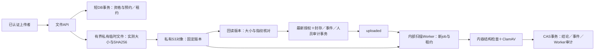

# P4-22 服务端文件上传与可信扫描设计

## 1. 目标、基线与当前状态

集团员工通过现有 OIDC 可信身份，在获准的单聊／群聊中预约并上传文件。只有服务端实测、固定对象版本校验、内容识别和真实恶意内容扫描均通过，才将文件记为 ready。ready 不授予访问权限，附件发送及下载分别在 P4-23／P4-24 实施。

用户已经确认 P4-21～P4-25 的分步路径、私有对象存储、应用服务端上传及每次重新授权下载，2026-10-04 再次要求“继续”。设计稿已提交为359656d；用户随后“继续”确认设计，进入逐任务实施计划阶段。尚未编写产品代码、添加依赖、执行新迁移或启动存储／扫描服务。[实施计划](../plans/2026-10-04-p4-22-upload-scan.md)待审阅。

当前基线 `a6dcd0b41d71a285673272ebe2153ae7bc1c0c3d`，对应 [P4-21 草稿 PR #69](https://github.com/leileipei/Enterprise_IM/pull/69)，OPEN／DRAFT；模型与000018迁移已实现，完整回归490顶层通过、0失败、1辅助跳过。具体证据见 [P4-21 验收记录](../../开发增量-P4-21-验收记录.md)。P4-21／更早草稿尚未合并。

### 已确定与本次建议

- 已确定：单文件单租户单会话；原上传 user／membership 固定；创建摘要沿用 internal/files；25 MiB 模型硬上限；八状态和13边不扩展；无客户端直连存储地址。
- 本次建议：AWS SDK for Go v2 的 S3适配器、ClamAV clamd、PDF结构检查使用qpdf；首批PDF、PNG/JPEG、UTF-8 TXT，Office／压缩包后续。用户已确认按推荐继续，首批类型固定为PDF、PNG/JPEG、UTF-8 TXT。
- 本次建议：默认上传关闭；管理员API持久化开关／大小／类型／预算，Web编辑在P4-25。测试用固定版本私有MinIO，不把社区历史版本当作已获生产验收的发行版。

## 2. 已核对的代码依赖

| 现有代码 | P4-22接入方式 |
| --- | --- |
| internal/files/create.go、metadata.go、lifecycle.go、events.go | 重用规范摘要和状态校验，不修改既有13边；上传和扫描租约放独立运行表，避免同状态写元数据 |
| internal/policystore/messages.go、group_message_send.go | 复用当前身份、会话及全群通信判定；仅抽取事务内授权助手，不调用发送方法、不占seq、不产生消息Outbox |
| internal/httpserver/admin.go等 | 复用Authenticator与TrustedIdentity，客户端不得提交tenant／user／扫描来源；任职仍走受保护选择头 |
| audit_events | 人员操作写现有业务审计；其actor两列非空，Worker不得伪造员工，新增文件Worker专用审计表 |
| cmd/im-api/main.go | 当前WriteTimeout=10秒；新增上传路由独立设置有界deadline，现有JSON／消息路由维持原时限 |
| access.Service保留配置模式 | 新文件上传配置使用版本及审批引用，提交时身份复核；不借用正文保留配置 |
| 000018与旧迁移测试清单 | 新增000019运行表，按依赖顺序Up／保护性Down；不重写000018 |

## 3. 方案与外部组件依据

| 方案 | 判断 |
| --- | --- |
| **推荐：S3接口适配＋服务端有界临时文件＋异步可信扫描** | API负责身份／测量／封存，Worker读取固定版本；不长持DB事务，响应丢失有独立恢复证据 |
| 收流、对象写入和扫描全过程持DB行锁 | 慢客户端及外部服务将扩大锁占用与事务寿命，不采用 |
| 客户端直传或对象存储预签名下载 | 不符合已选应用授权入口，本轮不采用 |

2026-10-04实查：MinIO社区仓库已于2026-04-25归档，README明确不再维护，并说明社区版本仅源码分发。保留已确认的S3／私有存储合约，本地联调记录固定源码提交或镜像digest、构建来源；生产发行版和维护来源仍需另行确定。此处不判定本项目的具体许可义务。[MinIO官方仓库](https://github.com/minio/minio)

S3适配器使用AWS SDK for Go v2，端点、路径寻址、凭据由部署提供。SDK支持自定义端点；其自动CRC校验不能替代本系统SHA-256。实施时核对并锁定实际模块版本和服务兼容性，PUT重试由本系统控制，禁止SDK自动重发制造无法识别的新对象版本。[端点文档](https://docs.aws.amazon.com/sdk-for-go/v2/developer-guide/configure-endpoints.html)、[校验和文档](https://docs.aws.amazon.com/sdk-for-go/v2/developer-guide/s3-checksums.html)

ClamAV用INSTREAM发送字节，必须验证StreamMaxLength以及引擎／特征库状态。超过扫描大小／递归限制不能被当作clean；配置启用限额、加密及损坏内容警报，并以真实样本验证。协议响应仅严格认可本次请求的完整clean／FOUND／ERROR，截断、多响应、未知响应均失败。[ClamD协议](https://docs.clamav.net/manual/Usage/ClamdProtocol.html)、[扫描文档](https://docs.clamav.net/manual/Usage/Scanning.html)

PDF在受限进程中用qpdf识别加密及检查结构，仅明确未加密且检查无错误／警告时继续。不同qpdf子命令退出码分别解释，不能全局将exit2当作同一种结果。qpdf是结构检查，不替代AV。[qpdf官方说明](https://qpdf.readthedocs.io/en/latest/cli.html)

这些文档只支持组件合约；它们不是本项目的运行、容量或安全验收证据。

## 4. 组件与数据流

建议边界：internal/files继续仅领域规则；internal/objectstore封装S3；internal/filescanner封装结构识别／clamd；internal/filetransfer编排外部I/O；internal/policystore提供文件事务及私有授权助手；internal/access提供管理员配置事务；internal/httpserver提供文件路由；独立cmd/im-file-worker运行内部任务。HTTP与领域包不依赖具体SDK类型。

## 5. 持久化上传配置

新增tenant_file_upload_policy及不可变版本历史。迁移为既有租户回填默认行，租户插入触发器为新租户建立相同默认；不使用各节点不同环境默认作为业务事实。

| 配置 | 首版默认与范围 |
| --- | --- |
| enabled | false；关闭时拒绝新预约／上传封存，不自动删除已存对象 |
| max_size_bytes | 26,214,400；可设置1～模型上限 |
| allowed_media_types | application/pdf、image/png、image/jpeg、text/plain；非空、排序去重，必须是当前实现已获类型验收的子集 |
| upload_ttl_seconds | 900；允许60～3600；新预约采用创建时值，旧预约不延长 |
| tenant_storage_budget_bytes | 1 GiB；可配置25 MiB～1 TiB；按尚未deleted文件的声明大小预留，包含失败／过期预约，防止隔离对象无限累积 |
| version、approval_reference | 非负int64版本，PUT期望版本一致且审批引用非空；记录实际管理员与时间，不声称核验外部审批单 |

并发保护：预约与配置写入按固定顺序锁当前配置行，在同一事务检查预算与新预约，避免超售。限额降低到现有预留量以下拒绝409；已有预约封存前按当前开关、类型、大小再次复核，预算不重复扣除。P4-24清理确认deleted后才释放预算；P4-22不会物理删除来释放空间，预算用尽时明确拒绝新预约。

GET／PUT `/api/v1/admin/file-upload-policy`仅集团管理员；普通用户不得读取审批历史或修改配置。GET `/api/v1/file-upload-policy`返回当前用户有效租户的有效开关／类型／大小／预约期限，不返回存储端点、配额使用明细、审批或扫描配置。配置历史查询由同增量API提供有界分页，模式沿用现有retention history。

## 6. 预约、上传尝试与原子封存

### 6.1 预约

POST `/api/v1/conversations/{id}/files`适用于单聊／群聊，JSON只有upload_request_id、original_filename、declared_media_type、declared_size_bytes（十进制字符串）；拒绝未知／重复字段、无效UUID、非规范类型及查询参数。

可信tenant／user来自OIDC，任职来自受保护选择头。必须当前任职有效，单聊选择与绑定任职一致、双方有效且允许send_message；群须当前有效成员、来源任职一致、active且全部当前成员的双向通信合规。管理员不绕过此规则。

文件ID由服务端随机UUID生成；请求唯一键和摘要沿用000018。同请求同参数只返回已授权可见的原记录，不延长TTL；不同参数409。重试不绕过当前身份与会话资格。新文件／初始事件／人员业务审计同事务提交，失败不留半条预约、不占消息seq或Outbox。新建201，同参数重试200。

### 6.2 独立上传尝试表

file_upload_attempts以tenant/file复合FK关联文件，保存服务端attempt UUID、接收／存储阶段、独占租约token／owner／expires_at、实测大小／SHA256、已知object_version_id、回查状态和时间。不写原始文件名、URL或客户端凭据。每文件只允许一个仍有效／待恢复的尝试；首次完整接收后固定实测指纹，不能在同一file ID的存储恢复流程中换内容。

租约只更新尝试表，不用同状态UPDATE修改file_objects或state_version。取得租约、开始外部写入以及最终封存都校验租约token和期限；等待后采用数据库事务中的最新时间，不以最初检查代替写入检查。

### 6.3 PUT字节流

PUT `/api/v1/files/{id}/content`使用application/octet-stream原始字节；不支持multipart、压缩请求体或任意客户端存储字段。请求不能提供SHA、对象版本、scan结果。

先认证、查同租户本人原任职文件、复核当前发送资格／配置／预约期限，再取租约。接收至0700目录中的随机0600临时文件，最多读声明大小＋1字节并受25MiB、60秒接收时限及有界节点并发限制；不将整个文件留在内存。大小必须与声明一致，流结束后SHA256才成为测量事实。失败清除本机未封存临时文件、登记人员失败审计；尚未开始存储的尝试可释放租约重试，预约TTL不改变。

节点上传并发首版最多4，扫描并发默认1；满额在读取请求体前429并可重试，不无界排队。结构检测Worker按512MiB／1CPU部署预算运行，clamd独立资源预算，实施时验证40百万像素边界及超时／进程异常不会记clean。

完整字节经受控的单次S3 PUT写到固定tenant/file key，带服务端attempt ID元数据；不把原文件名作为路径或存储元数据。bucket须预建私有、启用版本定位，默认关闭匿名与直连访问。缺少非空版本ID（包括null版本语义）、无法确认版本能力或回读不符，禁止封存。

成功PUT后以返回的固定version回读，重新计算完整大小与SHA，不能以ETag或对象自报元数据代替测量。完成后开启短事务重新锁身份／会话／政策／配置／文件／尝试，复核当前资格、TTL、租约token和新时间；uploaded元数据、upload_sealed事件、人员审计及尝试完成标记一起提交。审计／事件失败全部回滚，存储对象保持隔离。

接收及外部I/O全流程最多150秒，租约180秒且每15秒续约，不能续过预约期限。上传路由使用ResponseController设有界读／写deadline，真实server测试证明超过原10秒仍可正确完成且150秒后停止；若包装器不支持deadline则fail closed。其他API保留10秒WriteTimeout。断连停止收流和外部任务，结果不明确走恢复流程。

### 6.4 响应丢失与恢复

在PUT前持久化attempt ID及实测指纹。PUT异常不自动重发；尝试进入recovery_pending。内部对账按固定key、attempt元数据和有界版本枚举回查，读取明确候选version的字节并核对大小／SHA。

- 唯一明确匹配：只保存恢复出的内部对象版本证据。
- 零匹配、多个匹配、服务不稳定或指纹不符：不选latest，不改成uploaded；保持不可用并停止有界重试。最多3次回查，之后等待明确处理，不能通过无限PUT制造对象版本。
- **对账Worker不能冒充用户写upload_sealed。**原上传者再次PUT相同字节，重新测量并认证、验证当前配置和资格，利用已恢复version完成user来源封存事务，不重新写对象。字节改变409。
- TTL已过、原任职失效或会话资格丢失：不能自动续期／封存；隔离证据保留，等待P4-24的保全感知清理。

未封存对象不会被扫描任务、附件消息或普通用户下载使用。对账不执行物理删除；存储成功与数据库提交不构成跨系统原子事务。

## 7. 内容识别与可信扫描

### 7.1 首批类型

已确认首批选择PDF、PNG/JPEG、UTF-8 TXT。声明类型、扩展名、实际识别须一致；不根据扩展名直接判定。PNG/JPEG必须通过完整结构解码和像素预算（首版40百万像素），TXT必须有效UTF-8且无NUL，PDF必须通过qpdf结构及未加密检查。ASCII／UTF-8文本识别只归一为text/plain，参数不进入模型MIME。

上传封存时记录基于字节的规范detected_media_type；不支持或类型矛盾使用规范application/octet-stream表达识别结果，后续可信检测拒绝，不伪称声明正确。需要详细结构检测的任务在扫描Worker执行；明确不支持的声明在预约阶段415拒绝。

Office、通用压缩包、可执行文件、HTML/SVG、音视频本轮不启用；管理员不能通过配置绕过未完成的类型验收。若用户选择扩大类型，在最终书面设计及计划中补齐容器、加密、解压预算和真实样本验证，再实施。

### 7.2 作业与租约

file_scan_jobs保存tenant/file/job UUID、领取时state_version及封存SHA、尝试次数、下一次可运行时间、owner token／租约、内部结果状态；作业以复合FK关联来源文件；领取时事件及对应版本由同一事务保持一致，不把历史job外键指向文件当前version。上传成功不调用scan同步阻塞HTTP，Worker用SKIP LOCKED有界领取。

uploaded→scanning或scan_failed→scanning按当前version CAS推进，每次新job UUID，状态／scan_started或scan_retry事件／Worker审计／作业领取同事务提交。扫描租约120秒，每15秒续约，单次外部检测总时限90秒；最大3次尝试，失败后10秒／30秒延迟，不无限重试。

进程崩溃导致scanning租约过期：先在短事务以旧job/version CAS转scan_failed，记scan_error及Worker审计；再按重试上限另领新job转scanning。不新增scanning→scanning边。旧Worker的完成和续约都须比较job、token及期望version，迟到返回不改文件、不伪造成功证据。

### 7.3 检测与结论

Worker只GET精确object_version_id，重新测量大小／SHA并与封存事实比较，读取限时、限字节。对象缺失、读错版本或指纹不同为scan_failed，不重写封存数据。

结构检测及clamd都受独立CPU／内存／并发／时间预算；clamd连接为内部受限网络或本机socket，不开放客户端访问。验证引擎版本、特征库版本和更新时间（首版24小时内），未知配置／过期库／通信错误／限额导致扫描不完整均不得ready。

结构检测产生明确否决时，rejected结果记录实际结构检测组件及规则版本，不伪造ClamAV引擎／特征库；未完整解析仍scan_failed。ClamAV结论使用实际引擎／特征库版本。

完整结构正常、当前允许类型／大小仍合规、同一封存指纹获得完整clean结论才ready；infected／加密或明确不允许内容为rejected；依赖／超时／无法完整解析为scan_failed。限制超出无clean，即使扫描服务返回OK也按检测前提不足拒绝。完成后重新读取当前上传配置，取消允许类型不能让正在运行的旧任务提升为ready。

完成事务检查当前state=scanning、job、token、version和最新租约时间；按领域校验写ready／rejected／scan_failed，生命周期事件和Worker审计原子提交。成功／拒绝完整结果保留引擎／特征库／scanned_at／同指纹scan_sha256；失败按000018不写完整结论，失败原因在受限机器审计中登记。扫描结论与员工通信授权分开，P4-23仍重新检查发送权限。

新增file_worker_audit_events保留可信Worker来源UUID、file/job、操作、固定原因代码、结果和时间；不可UPDATE／DELETE。不改现有audit_events人员必填约束，不冒充上传者或管理员。员工状态查询仅显示通用状态，不返回病毒签名、扫描原始输出、job/token或服务器路径。

## 8. HTTP合约与可见性

| 接口 | 合约 |
| --- | --- |
| POST /api/v1/conversations/{id}/files | 首次201，幂等200；字段见6.1，状态DTO |
| PUT /api/v1/files/{id}/content | 首次成功封存200；已封存PUT统一409 file_already_uploaded，不读替换字节或写新对象；封存响应丢失用GET核对，尚未封存恢复按6.4测量相同字节 |
| GET /api/v1/files/{id} | 仅本人、原任职仍有效且仍是当前会话参与者；policy_blocked时可看本人提交状态，但不能重新上传；已退群／结束会话／其他任职／其他用户／跨租户404 |
| GET /api/v1/file-upload-policy | 普通有效身份读取有效上传限制，无部署信息 |
| GET/PUT /api/v1/admin/file-upload-policy | 集团管理员，配置持久化、version CAS、审批及审计 |
| GET /api/v1/admin/file-upload-policy/history | 集团管理员、有界分页不可变历史 |

状态DTO只含file_id、conversation_id、原声明名称／类型／大小、state、state_version、created_at、upload_expires_at。大小和版本为十进制字符串，时间RFC3339，no-store／nosniff。不返回定位、version ID、摘要、扫描原始结果或任何下载URL。GET是本人上传状态查询，不提供附件元数据搜索。

未认证401；无效当前身份403 invalid_identity；无法证明资源参与资格统一404；幂等参数／并发尝试／已封存替换／预算／版本冲突409；节点并发满额429；实测超限413；类型不允许415；过期预约410；依赖／审计失败503，日志与响应使用固定代码不暴露私有信息。资源资格验证先于410及状态差异，避免文件探测。存储中／恢复中返回409 upload_in_progress或503 upload_recovery_pending；客户端可安全查询状态，不能据此取得对象访问权。

严格限制方法、查询、请求头、JSON重复字段、body大小及Content-Encoding。已封存PUT统一409，客户端GET确认现有状态，不会将未读取的新字节假报上传成功；替换须新建file ID。资源资格验证仍在冲突响应之前，实施计划须用测试冻结这一行为。

## 9. 原子性、锁与失败边界

所有事务显式READ COMMITTED；租约与预约在锁等待后用clock_timestamp()取得最新数据库时间，而非事务开始的now()。身份／组织／租户及策略资格在实际写入前使用最新时点复核；policy发布、成员变更和配置更新与封存有明确锁／CAS串行化。固定锁顺序：相关身份按UUID排序→会话及成员快照→当前通信策略→上传配置→文件→运行租约／作业。旧代码存在不同操作次序时采用已有NOWAIT／40P01有界整事务重试，不在失去资格后重用旧allow决策。

每次重试重新授权；仅重试纯DB事务，不能包住外部PUT后自动重发。对身份生效期限、白名单到期、群policy_blocked变化必须在锁等待后再判断。抽取授权助手须保持现有消息行为及测试，不顺便重构目录／搜索。

事件与人员／机器审计失败时数据库业务状态不推进。外部对象已成功时状态回滚不删除对象；attempt恢复证据能找到隔离版本。审计事务也不可用时接口503，不宣称已接受／扫描完成，存储证据等待恢复。

API和Worker默认关闭。生产API开关要求OIDC、有效部署S3配置和版本能力；Worker单独显式配置DB、只读对象凭据及scanner端点。部署凭据和地址从受控部署配置读取，业务开关及限制持久化。测试启动专用容器与任务不代表生产启用。CLI预检无条件安装、自动购买或申请许可均不属于本设计。

## 10. 新迁移与保护性Down

000019建议包含上传配置／历史、上传尝试、扫描作业、Worker审计及必要部分索引／字段触发器，不增加file_objects状态或改变000018摘要规则。服务上线前迁移和配置审批须有独立记录。

全部运行表复合tenant/file FK；job／attempt UUID唯一；租约时间、阶段字段、实际指纹32字节和预算范围明确CHECK，避免NULL三值逻辑绕过。配置历史／Worker审计不可变；运行状态更新按预期token和version。未来删除和保全会通过文件所属会话关联这些证据。

Down在显式READ COMMITTED事务先按固定依赖顺序ACCESS EXCLUSIVE锁新表及相关租户默认配置触发器所属表，存在任何上传尝试、扫描作业、机器审计或用户配置历史即拒绝。只存在自动默认配置且无运行证据时允许保护性回滚；对默认配置是否被修改不能靠“没有历史”推断，需校验明确默认版本／值。无CASCADE，不删除000018文件证据，不改变旧消息。

## 11. 验收矩阵（均为待实施要求）

| 领域 | 必须运行的证据 |
| --- | --- |
| 实际组件 | 锁定SDK／MinIO／ClamAV／qpdf版本和配置；私有bucket匿名拒绝、versioning、固定版本回读及病毒库状态；无依赖SKIP不得宣称通过 |
| 预约／配置 | 同请求同参数一行、一初始事件／审计；不同参数409；跨租户／他人／原任职停用／退群／policy_blocked拒绝；预算及配置版本并发不超售 |
| 真实收流 | 1／上限、0／短读／多1字节、分块、断连、60秒接收和150秒总超时；受控临时权限／资源；真实HTTP服务器超过原10秒成功而旧路由不放宽 |
| 存储／恢复 | 不支持version拒绝；对象已写响应丢失、DB失败／进程中断、固定version被另版本覆盖、回读摘要错误；无自动重复PUT，租约过期旧请求不封存 |
| 扫描 | 实际ClamAV clean和EICAR（标准测试样本）、timeout／ERROR／库过期、限额与损坏解析；PDF正常／加密／损坏、图片完整／尺寸超限、TXT编码／NUL与伪MIME |
| 并发／事务 | 两节点同文件上传互斥；旧扫描作业迟到、租约过期接管、新job及CAS；政策／身份／配置在等待期间改变；事件／人员及Worker审计失败均回滚状态 |
| 权限／响应 | 实际OIDC＋API＋PG，查询只属于本人原任职，状态不泄漏key／URL／摘要／扫描原文；管理员无普通文件特权，方法／JSON／响应头严格校验 |
| 迁移 | 真PG Up／空安全Down／有运行或配置历史拒绝Down、等待并发提交后保护证据、再Up；旧消息和所有既有回归通过 |

以上是验收要求，没有实际运行结果。P4-22不宣称完成发送／下载／法务保全与对象物理清理的F01或完整M4；名称搜索仍P4-25，备份恢复与生产容量仍需客户环境验收。

## 12. 分层实施与审阅交接

书面设计确认后编写实施计划，保持当前助手逐任务实现的方式：

1. 配置／运行证据领域规则、000019迁移与真实PG约束测试。
2. 预约／状态／管理员配置事务及可信身份HTTP合约。
3. 固定版本S3适配器和真实私有存储验证。
4. 有界收流、租约、指纹固定、原子封存及恢复对账。
5. 内容结构识别、真实ClamAV适配及严格错误／限额处理。
6. 扫描领取／恢复／CAS及机器审计事务。
7. 生产装配、默认关闭开关、真实OIDC/API/组件联调、完整回归及独立评审／草稿交付。

实施计划已将这些分层拆成10项，具名列出RED／GREEN、文件／接口和交付门禁；任务尚未实施。不重复询问是否改用实现子代理。

### 设计自检

本稿不重造P4-21状态／摘要；租约在独立表；Worker不冒充人员；对账不自动用户封存；对象存储与PG非原子；扫描限额／加密／库状态不作为clean；当前身份与配置在写入时复核；未知对象版本不自动重传；上传长请求不放宽旧API；预算保留隔离失败证据；所有验收矩阵为未来要求。

本次设计未安装SDK／MinIO／ClamAV／qpdf，未启动Worker，未修改旧消息路由、未合并或部署。首批类型已确认；生产存储发行版仍待实际发行来源审阅，生产版本选择不阻止先制定适配器和本地联调实施计划。

## 2026-10-04 已批准扫描限额修正

用户确认采用实测推荐方案：上传及INSTREAM仍限25MiB；MaxFileSize=0，MaxScanSize=250MiB，MaxRecursion=16、MaxFiles=10000，超限／加密／损坏报警开启；MaxEmbeddedPE、HTML／脚本规范化、ZIP类型识别及PCRE内部文件预算均与250MiB全局配额一致。用标准EICAR末尾嵌套ZIP与实际全局／递归／条目限额样本验证行为，不以OK响应或配置字段替代完整扫描证据。
